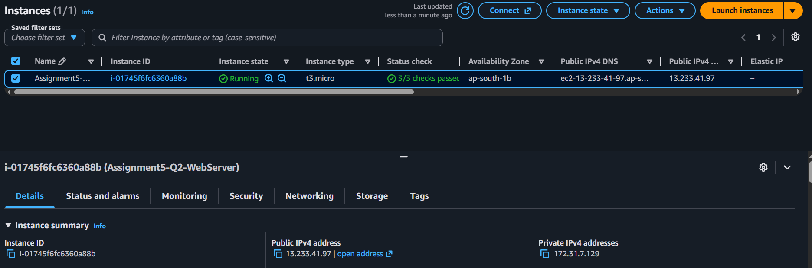
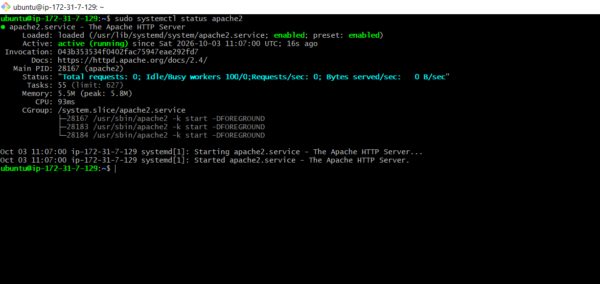
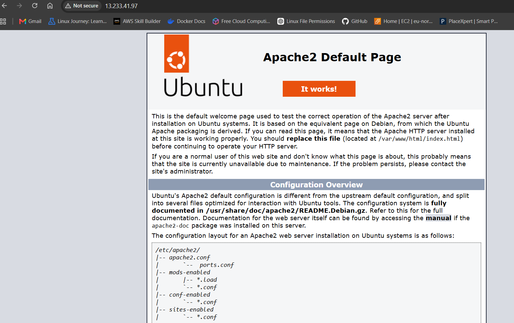
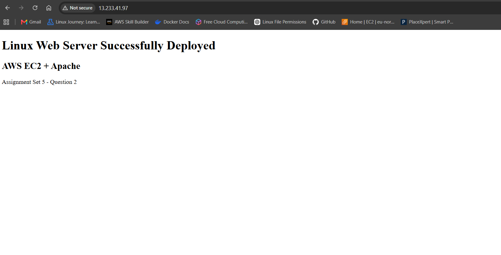
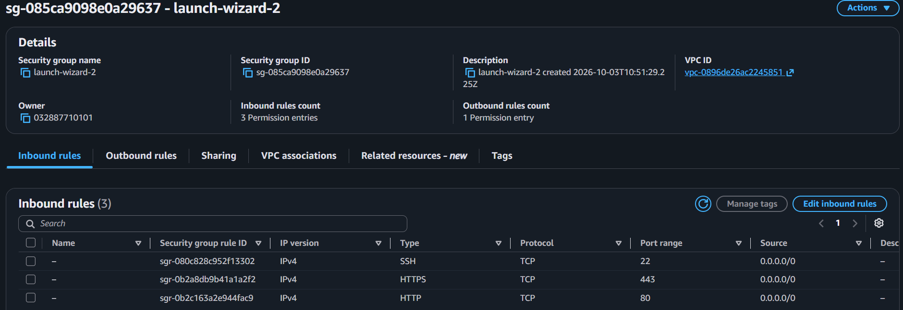
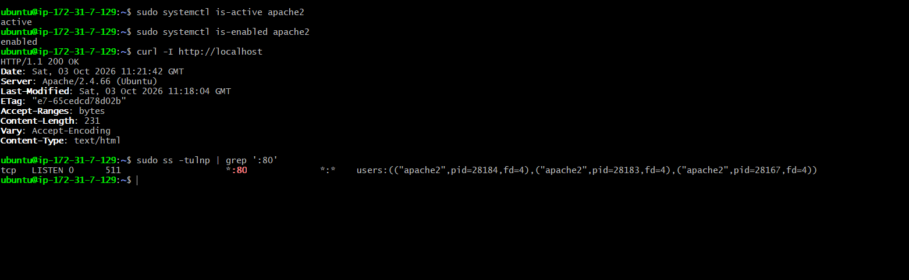

# AWS Assignment Set 5 — Question 2
## Linux Web Server on Amazon EC2 with Security Group

### 1. Project Objective

Deploy a Linux web server on Amazon EC2, secure it with an AWS Security Group, install Apache HTTP Server, host a custom webpage, and verify that the web server is accessible over the network.

This project is **Question 2 of AWS Assignment Set 5**.

### 2. AWS Services and Technologies Used

- **Amazon EC2** — Linux virtual server
- **Amazon VPC / Security Group** — network access control
- **Ubuntu Server** — operating system
- **Apache HTTP Server** — web server
- **SSH** — remote server administration
- **HTTP / HTTPS** — web traffic

### 3. Architecture

```text
                         Internet
                            |
                +-----------+-----------+
                |    EC2 Security      |
                |       Group          |
                |----------------------|
                | SSH   TCP 22         |
                | HTTP  TCP 80         |
                | HTTPS TCP 443        |
                +-----------+----------+
                            |
                            v
                +-----------------------+
                |     EC2 Instance      |
                |     Ubuntu Linux      |
                |                       |
                |      Apache2          |
                |      Web Server       |
                +-----------+-----------+
                            |
                            v
                    /var/www/html/
                       index.html
                            |
                            v
                    Custom Web Page
```

### 4. EC2 Configuration

| Configuration | Value |
|---|---|
| Instance name | `Assignment5-Q2-WebServer` |
| Instance type | `t3.micro` |
| Operating system | Ubuntu Server |
| Availability Zone | `ap-south-1b` |
| Public IPv4 used for testing | `13.233.41.97` |
| Web server | Apache2 |

> **Note:** The public IPv4 address can change if the instance is stopped and started without an Elastic IP. Do not treat the address above as permanent.

### 5. Security Group Configuration

Security Group captured in the evidence:

- Security Group ID: `sg-085ca9098e0a29637`
- Inbound rules: 3
- Outbound rules: 1

| Protocol | Port | Source | Purpose |
|---|---:|---|---|
| TCP | 22 | `0.0.0.0/0` | SSH remote administration |
| TCP | 80 | `0.0.0.0/0` | HTTP web traffic |
| TCP | 443 | `0.0.0.0/0` | HTTPS web traffic |

#### Port justification

**TCP 22 — SSH**  
Used to connect remotely to the Ubuntu EC2 instance for administration and configuration.

**TCP 80 — HTTP**  
Used to serve the website over standard HTTP. The custom webpage was successfully accessed through the EC2 public IPv4 address.

**TCP 443 — HTTPS**  
Reserved/allowed for secure HTTPS web traffic at the Security Group level.

### 6. Security Hardening Note

The captured Security Group currently allows SSH (`22`) from `0.0.0.0/0`, meaning the SSH port is reachable from any IPv4 address.

For a production or security-focused deployment, SSH should normally be restricted to the administrator's trusted public IP address (for example, **My IP**) or another controlled access mechanism.

This README records the configuration actually captured in the project evidence rather than claiming a restriction that was not present in the screenshot.

### 7. Apache Installation

Apache was installed on Ubuntu using:

```bash
sudo apt update
sudo apt upgrade -y
sudo apt install apache2 -y
```

Apache service verification:

```bash
sudo systemctl status apache2
```

The captured output shows:

```text
Active: active (running)
```

Apache is also enabled to start automatically:

```bash
sudo systemctl is-enabled apache2
```

Expected/result captured:

```text
enabled
```

### 8. Custom Web Page

The website content was created in:

```text
/var/www/html/index.html
```

The deployed page contains:

```text
Linux Web Server Successfully Deployed
AWS EC2 + Apache
Assignment Set 5 - Question 2
```

The page was successfully opened from a web browser using the EC2 public IPv4 address.

### 9. Testing and Verification

#### Apache service

```bash
sudo systemctl is-active apache2
```

Result:

```text
active
```

#### Apache startup configuration

```bash
sudo systemctl is-enabled apache2
```

Result:

```text
enabled
```

#### HTTP response

```bash
curl -I http://localhost
```

Result:

```text
HTTP/1.1 200 OK
Server: Apache/2.4.66 (Ubuntu)
Content-Type: text/html
```

#### Port 80 listener

```bash
sudo ss -tulnp | grep ':80'
```

Result showed Apache listening on TCP port 80:

```text
*:80
users:(("apache2", ...))
```

#### Browser test

The custom webpage was successfully accessed through the EC2 public IPv4 address.

### 10. Evidence Screenshots

The following screenshots provide visual proof of the AWS configuration, Apache deployment, Security Group rules, and testing results.

#### Screenshot 1 — EC2 Instance status 



Shows the running EC2 instance `Assignment5-Q2-WebServer` and Apache service status.

#### Screenshot 2 — Apache Web Server status 




#### Screenshot 3 — Apache2 Default Web Server Page




#### Screenshot 4 — Custom Webpage Successfully Deployed


Shows the configured inbound rules for SSH (22), HTTPS (443), and HTTP (80).

#### Screenshot 5 — EC2 Security Group Inbound Rules



Shows Apache service verification, an HTTP `200 OK` response from `curl`, and Apache listening on port 80.

#### Screenshot 6 — EC2 Instance Configuration and Public IP


Additional evidence captured during the project.

### 11. Key Commands Used

```bash
# Update Ubuntu
sudo apt update
sudo apt upgrade -y

# Install Apache
sudo apt install apache2 -y

# Check Apache
sudo systemctl status apache2

# Check whether Apache is running
sudo systemctl is-active apache2

# Check whether Apache starts automatically
sudo systemctl is-enabled apache2

# Test local HTTP response
curl -I http://localhost

# Check listening ports
sudo ss -tulnp | grep ':80'
```

### 12. Result

The Linux web server was successfully deployed on Amazon EC2 using Ubuntu and Apache. The Security Group was configured with SSH, HTTP, and HTTPS inbound rules. Apache was verified as active and enabled, port 80 was verified as listening, and a custom webpage was successfully served to a browser through the EC2 public IPv4 address.

### 13. Project Status

**Implementation:** Completed  
**Apache:** Running  
**Custom webpage:** Working  
**HTTP port 80:** Verified  
**Security Group:** Configured  
**Documentation:** Completed

---

## Assignment Requirement Mapping

| Assignment requirement | Status | Evidence |
|---|---|---|
| Deploy Linux web server on EC2 | Completed | EC2 screenshot |
| Configure appropriate Security Group | Completed | Security Group screenshot |
| Allow SSH | Completed | Port 22 rule |
| Allow HTTP | Completed | Port 80 rule |
| Allow HTTPS | Completed | Port 443 rule |
| Install Apache/Nginx | Completed | Apache service output |
| Explain allowed ports | Completed | Port justification section |
| Testing results | Completed | Command outputs + browser test |
| Documentation/README | Completed | This file |
